# PodVerse

**A Vite + ReactJS application for creating, editing, and sharing AI-powered podcasts and avatars.**

---

## 📖 Abstract
PodVerse is an all-in-one podcasting toolkit built with Vite and React. It lets users convert text into podcast episodes, clone voices, remove background noise from audio, and generate lifelike talking avatars. Designed for content creators, educators, and hobbyists, PodVerse streamlines every step of podcast production and AI avatar creation in a single intuitive interface.

---

## 📝 Introduction
PodVerse addresses the growing need for accessible audio content creation tools by integrating four core features—Text-to-Podcast, Voice Cloning, Audio Background Remover, and AI Avatars—into one cohesive web application. Built on a modern stack (Vite, React, Node.js), it offers lightning-fast performance, a sleek UI, and end-to-end workflows from script to final audio or video avatar.

---

## ❓ Problem Statement
- **Barrier to entry:** Traditional podcasting requires recording equipment, editing software, and a production pipeline that can intimidate newcomers.
- **Resource constraints:** Small teams or solo creators often lack time, budget, or expertise to hire audio engineers or voice actors.
- **Fragmented toolchain:** Users must jump between multiple services (text-to-speech, noise-reduction, voice-cloning, avatar generation), each with its own integration challenges.

---

## 💡 Proposed Solution
PodVerse unifies all steps of modern podcast and avatar production in one platform:
1. **Text-to-Podcast:** Convert any text or PDF into a downloadable podcast episode in seconds.
2. **Voice Cloning Studio:** Upload or record a sample voice (or pick from celebrity samples) and synthesize speech that matches.
3. **Audio BG Remover:** Clean up noisy recordings with a single click, yielding studio-quality audio.
4. **AI Avatars:** Turn a photo into a talking digital avatar, synced to typed script or uploaded audio.

By centralizing these features, PodVerse minimizes tool-hopping, accelerates iteration, and empowers anyone to produce professional-grade audio and video content.

---

## 🚀 Key Features

### 1. Text-to-Podcast
- **Chats Sidebar:**  
  - “New Chat” button (first message becomes chat title).  
  - Context menu to Share or Delete past chats.
- **Conversation View:**  
  - Header shows chat title.  
  - Audio player with play/pause, ±10s skips, progress bar, timestamps, share & download.  
  - Copy-text icon to quickly grab your prompt.
- **Input Controls:**  
  - Text input with “Type your message here…”  
  - “Inspire” button for 4–5 random prompts.  
  - “Upload File” (PDF/text).  
  - Language selector (EN, HI, MR, GU, ES, FR, DE, IT, JP, ZH, RU, PT, KO, TR).  
  - “Select Duration” (30 s, 1 min, 2 min, 3 min).  
  - “Select Speaker 1/2” dropdowns (2–6 voices per language) with profile pictures, “Play Sample” buttons.  
  - “Send” to generate podcast—automatically saved in Chats.

### 2. Voice Cloning Studio
- **Tabs:**  
  - **Upload Voice:** Upload WAV/MP3 or record directly in-browser.  
  - **Sample Voices:** Pre-cloned celebrities (e.g., Shahrukh Khan, Elon Musk).
- **Workflow:**  
  1. Choose or upload a voice sample.  
  2. Enter script text.  
  3. Click **Generate Voice**.  
  4. Download or play the cloned-voice audio.

### 3. Audio Background Remover
- **Upload/Record:** Drag & drop or in-app recording.  
- **One-Click Cleanup:** AI-powered noise reduction.  
- **Output:** Studio-quality WAV download.

### 4. AI Avatars
- **Photo Upload:** JPEG/PNG; auto-detects gender.  
- **Input Modes:**  
  - **Text → Speech:** Type up to 500 characters.  
  - **Audio → Lip-Sync:** Upload WAV/MP3/M4A for exact tone mimicry.  
- **Generate Avatar:**  
  - Outputs a video-format avatar in a built-in player.  
  - Saved automatically in sidebar for sharing.

---

## 📸 Screenshots

<div style="animation: fadeIn 2s;">

<div align="center">
  <div style="display: flex; justify-content: center; flex-wrap: wrap; gap: 20px;">
    <div style="width: 45%; min-width: 300px; margin-bottom: 20px;">
      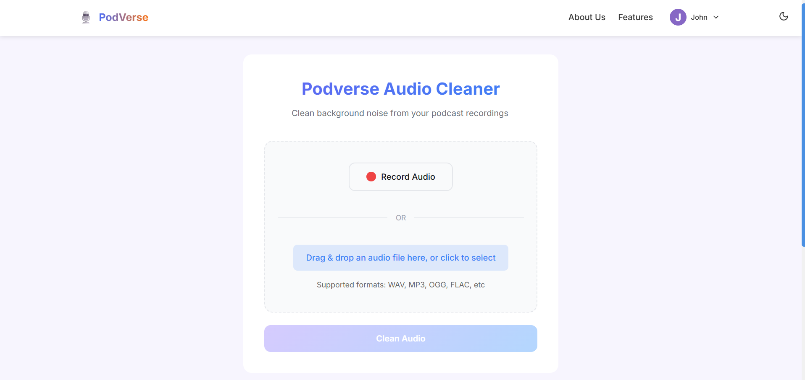
      <p><strong>Audio Background Remover</strong><br/>Clean up noisy recordings with one click.</p>
    </div>
    <div style="width: 45%; min-width: 300px; margin-bottom: 20px;">
      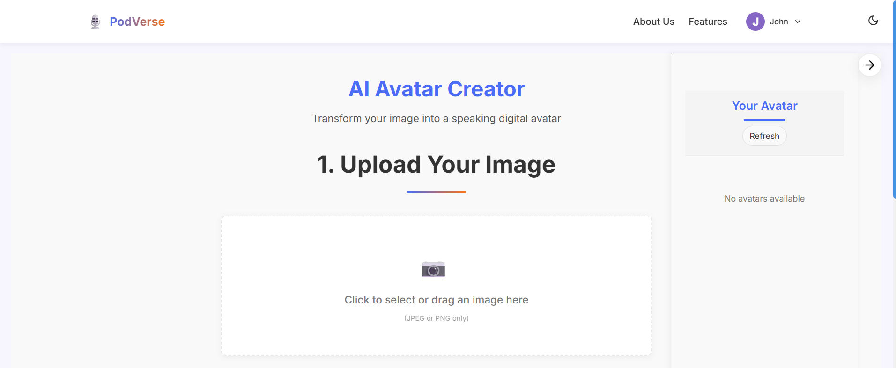
      <p><strong>AI Avatar #1</strong><br/>Generate a talking avatar from a photo.</p>
    </div>
  </div>

  <div style="display: flex; justify-content: center; flex-wrap: wrap; gap: 20px;">
    <div style="width: 45%; min-width: 300px; margin-bottom: 20px;">
      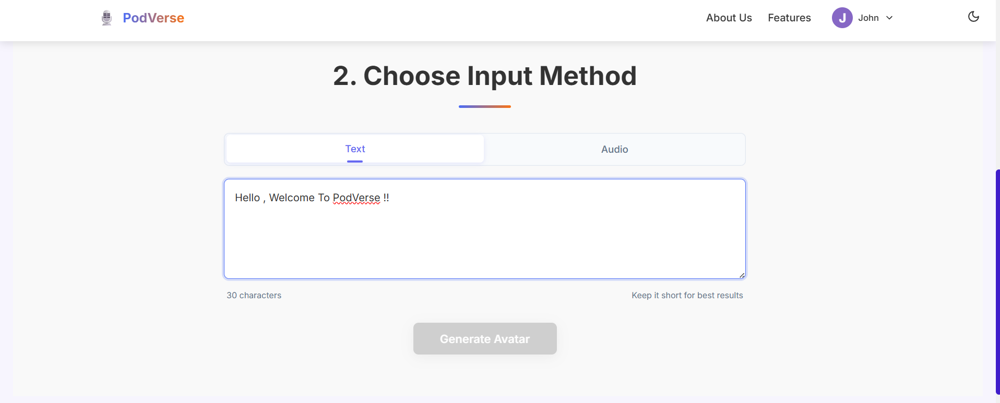
      <p><strong>AI Avatar #2</strong><br/>Lip-sync your own voice or typed text.</p>
    </div>
    <div style="width: 45%; min-width: 300px; margin-bottom: 20px;">
      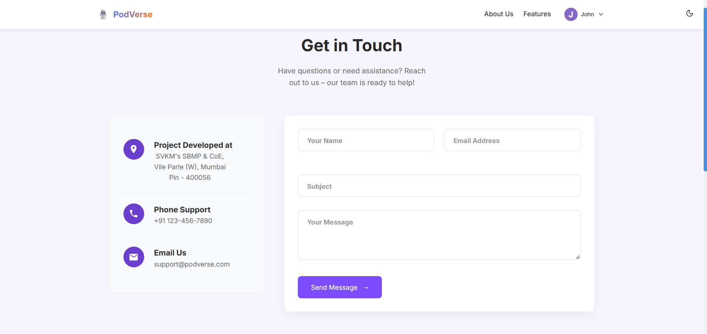
      <p><strong>Contact Us</strong><br/>Get in touch for support or feedback.</p>
    </div>
  </div>

  <div style="display: flex; justify-content: center; flex-wrap: wrap; gap: 20px;">
    <div style="width: 45%; min-width: 300px; margin-bottom: 20px;">
      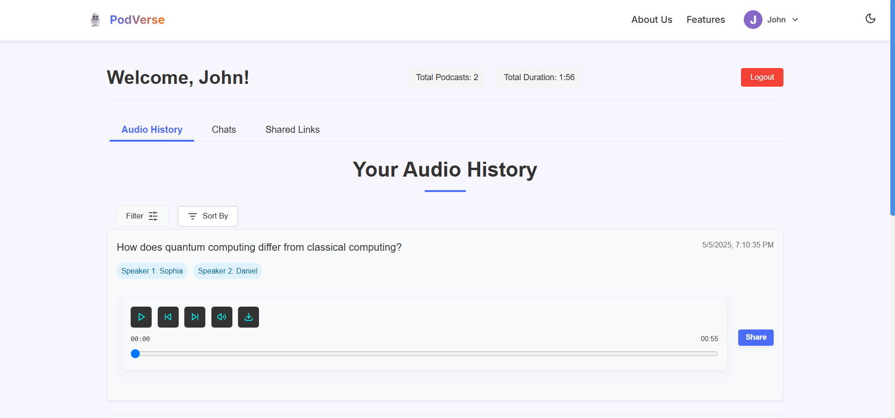
      <p><strong>Dashboard #1</strong><br/>Overview of chats and generated episodes.</p>
    </div>
    <div style="width: 45%; min-width: 300px; margin-bottom: 20px;">
      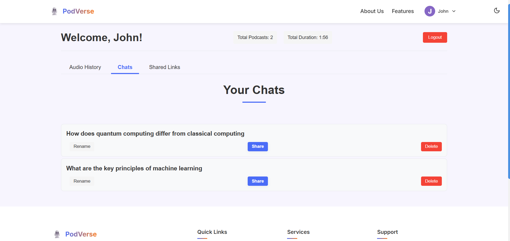
      <p><strong>Dashboard #2</strong><br/>Manage your saved history and settings.</p>
    </div>
  </div>

  <div style="display: flex; justify-content: center; flex-wrap: wrap; gap: 20px;">
    <div style="width: 45%; min-width: 300px; margin-bottom: 20px;">
      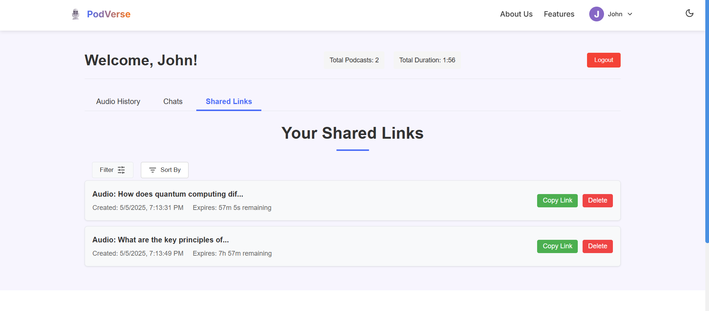
      <p><strong>Dashboard #3</strong><br/>Quick access to voice-cloning studio.</p>
    </div>
    <div style="width: 45%; min-width: 300px; margin-bottom: 20px;">
      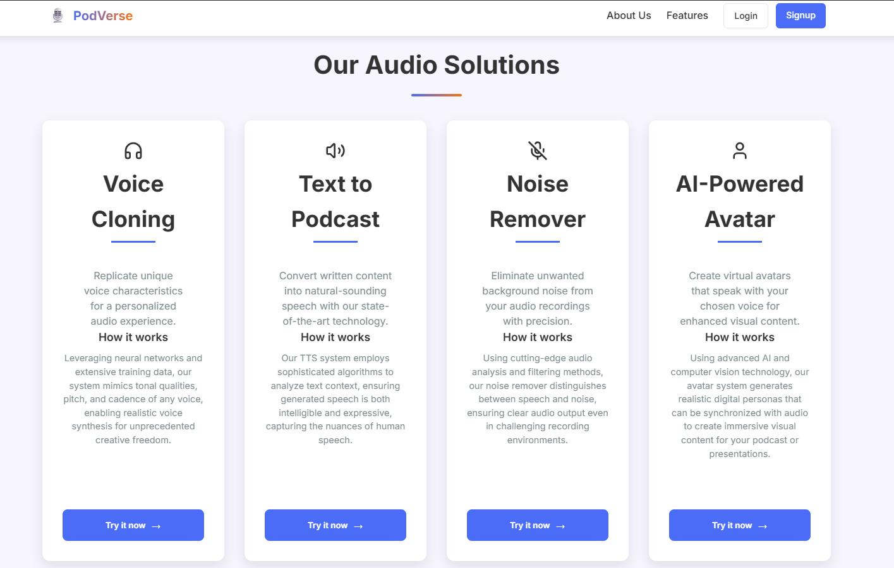
      <p><strong>Features</strong><br/>Four core modules in one platform.</p>
    </div>
  </div>

  <div style="display: flex; justify-content: center; flex-wrap: wrap; gap: 20px;">
    <div style="width: 45%; min-width: 300px; margin-bottom: 20px;">
      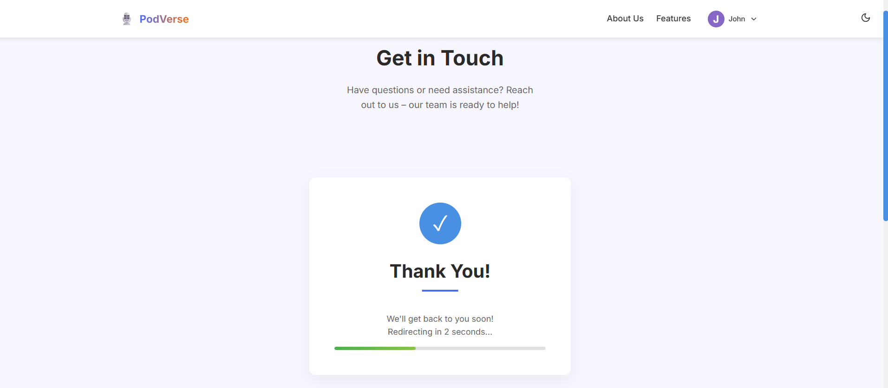
      <p><strong>Get In Touch</strong><br/>Reach out for demos or enterprise plans.</p>
    </div>
    <div style="width: 45%; min-width: 300px; margin-bottom: 20px;">
      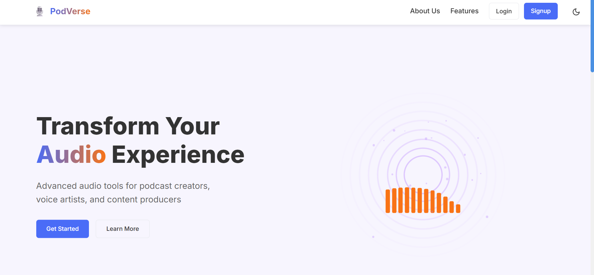
      <p><strong>Main Page</strong><br/>Welcome screen with feature highlights.</p>
    </div>
  </div>

  <div style="display: flex; justify-content: center; flex-wrap: wrap; gap: 20px;">
    <div style="width: 45%; min-width: 300px; margin-bottom: 20px;">
      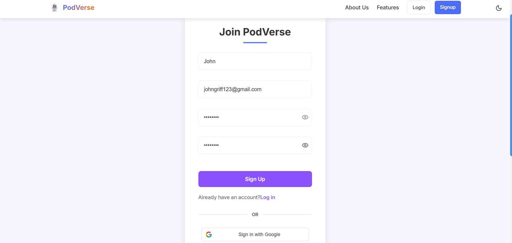
      <p><strong>Sign Up</strong><br/>Create your PodVerse account to get started.</p>
    </div>
    <div style="width: 45%; min-width: 300px; margin-bottom: 20px;">
      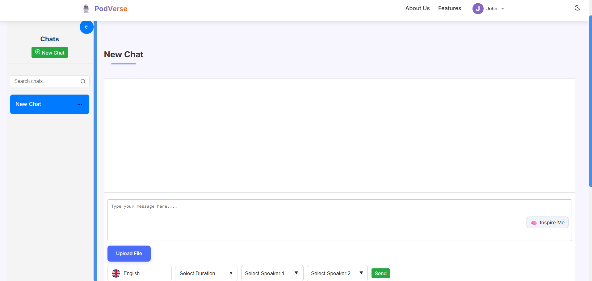
      <p><strong>Text-to-Podcast</strong><br/>Type or upload text, select voice & language.</p>
    </div>
  </div>

  <div style="display: flex; justify-content: center; flex-wrap: wrap; gap: 20px;">
    <div style="width: 45%; min-width: 300px; margin-bottom: 20px;">
      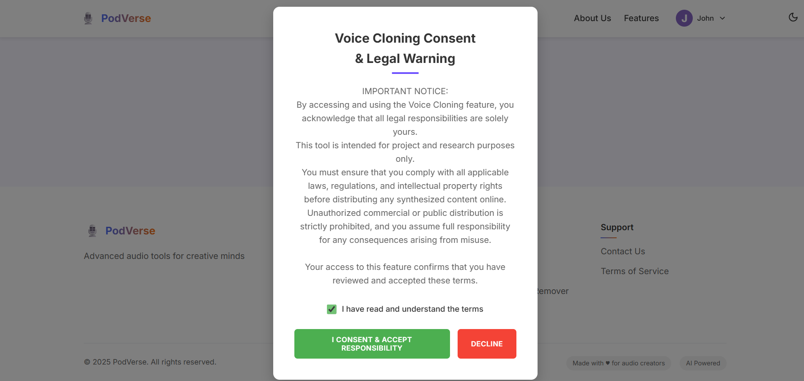
      <p><strong>Voice Cloning Consent</strong><br/>User agreement before cloning a voice.</p>
    </div>
    <div style="width: 45%; min-width: 300px; margin-bottom: 20px;">
      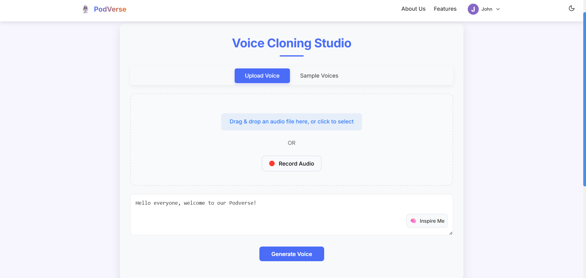
      <p><strong>Voice Cloning #1</strong><br/>Upload or record your sample voice.</p>
    </div>
  </div>

  <div style="display: flex; justify-content: center; flex-wrap: wrap; gap: 20px;">
    <div style="width: 45%; min-width: 300px; margin-bottom: 20px;">
      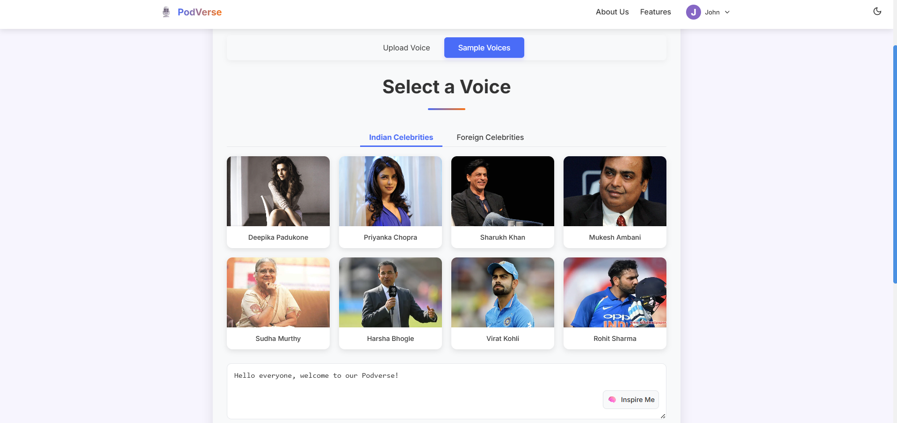
      <p><strong>Voice Cloning #2</strong><br/>Select from celebrity presets or your own.</p>
    </div>
    <div style="width: 45%; min-width: 300px; margin-bottom: 20px;">
      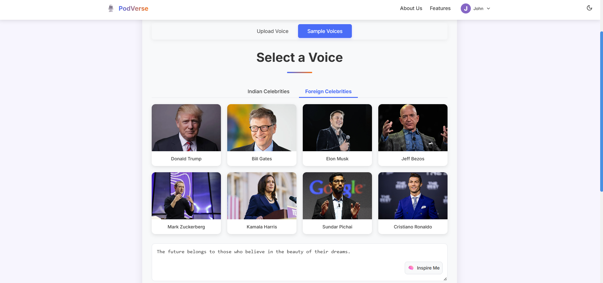
      <p><strong>Voice Cloning #3</strong><br/>Generate and download your cloned audio.</p>
    </div>
  </div>
</div>

</div>


---
## 📂 Directory Structure
```
📁 mypodcast
│   ├── 📁 .git
│   ├── 📁 api
│   ├── 📁 backend
│   ├── 📁 local_images
│   ├── 📁 node_modules
│   ├── 📁 public
│   ├── 📁 results
│   ├── 📁 src
│   ├── 📁 uploads
│   ├── 📄 .gitignore
│   ├── 📄 eslint.config.js
│   ├── 📄 index.html
│   ├── 📄 package.json
│   ├── 📄 package-lock.json
│   ├── 📄 PodVerse.png
│   ├── 📄 README.md
│   ├── 📄 tailwind.config.js
│   └── 📄 vite.config.js
📁 uploads
📄 .hintrc
```
> **Note:** We include `.venv/` in version control to ensure `requirements.txt` is always available for reproducible backend builds.

---

## 🎯 Applications
- **Independent Podcasters:** Rapid prototyping of episodes without recording gear.  
- **Educational Content:** Generate narration and avatars for e-learning modules.  
- **Marketing & AGencies:** Quickly produce brand-voice podcasts and animated spokes-avatars.  
- **Accessibility:** Text-based content can be turned into spoken form in multiple languages.

---

## ⚖️ Legal Considerations

- **Project Code License:** All source code and assets of PodVerse are released under the [MIT License](https://opensource.org/licenses/MIT), granting full reuse, modification, and distribution rights with attribution.
- **Voice Samples License:** Pre-cloned celebrity voices (e.g., Shahrukh Khan, Elon Musk) are provided under the [Creative Commons Attribution 4.0 International (CC BY 4.0)](https://creativecommons.org/licenses/by/4.0/) license. Users must give appropriate credit when using or redistributing these voice models.
- **User-Provided Content:**
  * **Text & PDFs:** Ensure you hold the necessary copyrights or permissions for any uploaded text.
  * **Audio Files:** You must own or have rights to any recorded or uploaded audio.
  * **Images:** Uploaded photos for avatar generation should be your own or licensed appropriately.
- **Privacy & Data Handling:** User uploads are processed securely and are not stored beyond the session unless explicitly saved.


---

## 👥 Contributors
- Jash Thakkar (@JashT14)  
- Neel Shah 
- Ganesh Palav

---

## 🔮 Future Enhancements
Based on early-access feedback, upcoming features include:

- **Favorite Voices:** Mark and quickly access your top voices.  
- **Emotional Expressions:** Add natural emotions (happy, sad, excited) to cloned voices.  
- **Multi-Avatar Podcasting:** Host real-time conversations among multiple AI avatars.  
- **Podcast Creation with Cloned Voices:** Script multi-voice episodes using cloned personas.  
- **Expanded Language & Speaker Library:** Support for more languages and regional accents.  
- **Multilingual Voice Cloning:** Clone voices outside EN-US (e.g., Hindi, Spanish).

---

> **License:** MIT  
